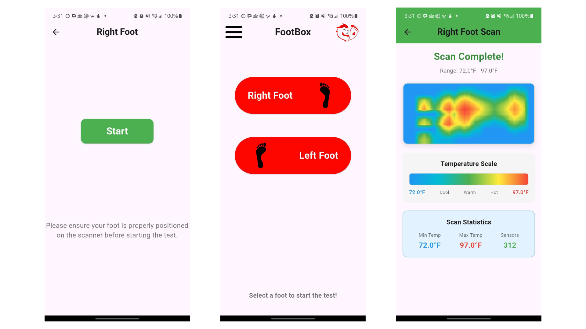
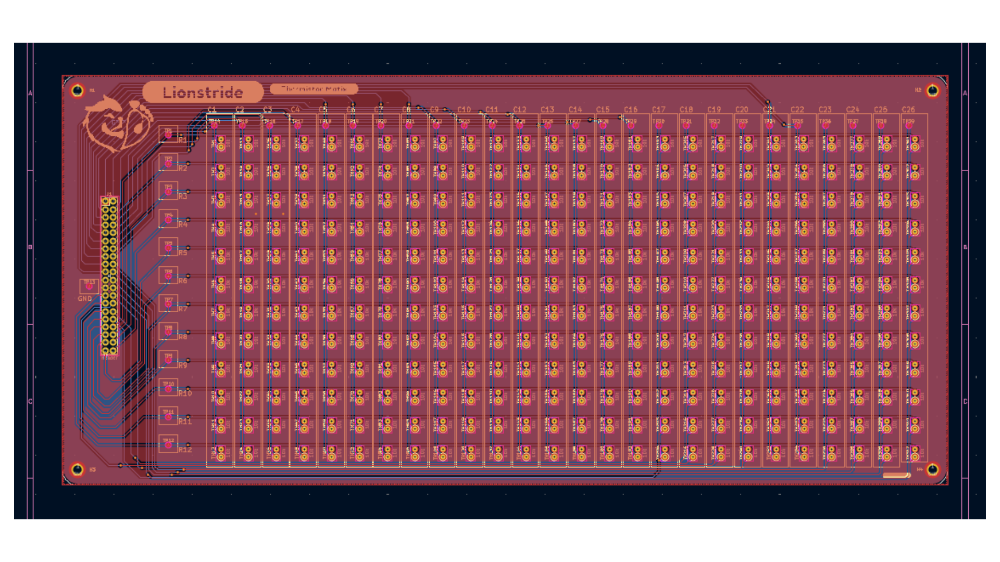
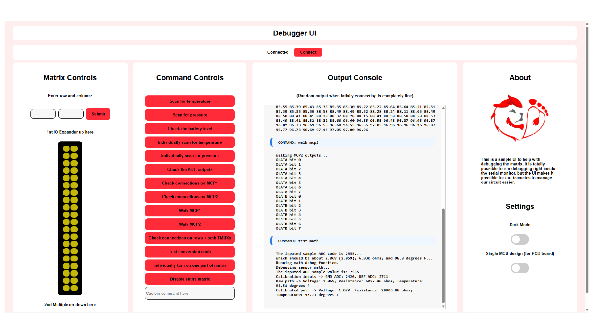

# lionstride-inventeam-2026

## Repository for all of the code and resources for the LMIT Inventeam, Lionstride.

 <!-- - -->  <!-- - -->  <!-- - -->  <!-- - -->  <!-- - -->  <!-- - -->  <!-- - -->  <!-- - -->  <!-- - -->  <!-- - -->  <!-- - -->  <!-- - -->  <!-- - -->  <!-- - -->  <!-- - --> 

<!-- Badeges from https://gprm.itsvg.in and https://github.com/Ileriayo/markdown-badges  -->
<!-- All badges link to the README: https://github.com/3pnguyen/lionstride-inventeam-2026/blob/main/README.md -->

    <table>
        <tr>
            <td></td>
            <td></td>
        </tr>
        <tr>
            <td></td>
            <td></td>
        </tr>
    </table>

## Socials
 

## Layout
Source code and other resources are in branches:

| **Branch** | **Purpose** | 
| :-- | :-- |
| main | Overview of repository |
| [app-source](https://github.com/3pnguyen/lionstride-inventeam-2026/tree/app-source) | Source code for the app |
| [device-schematic](https://github.com/3pnguyen/lionstride-inventeam-2026/tree/device-schematic) | Schematics of the device |
| [device-source](https://github.com/3pnguyen/lionstride-inventeam-2026/tree/device-source) | Source code for the device |
| [website-source](https://github.com/3pnguyen/lionstride-inventeam-2026/tree/website-source) | Source code for the website/debugger UI |

## Description

"Our invention, the Footbox, functions as an early ulcer-detection system that utilizes heat and pressure abnormalities in users. If a localized hotspot of approximately 2.2 degrees Celsius and/or a pressure of 150 kPa (relative to the user's average plantar temperature and pressure measured from a baseline static position) is detected on any part of either foot, the Footbox will alert the user. The Footbox features a thermistor array and a pressure sensor on each side, one for each foot. For the user to collect data, they will step (with approximately equal weight distribution) on the Footbox twice, rotating 180 degrees upon the second scan. The rotation switches which foot is in contact with the thermistor array and the pressure sensor. The entire process is estimated to take no more than 1 minute. The data is then sent to the user's device. The purpose of the Footbox is to provide a hands-free, cost-effective way for people with diabetes who struggle with flexibility to detect ulcers before they reach a critical stage."
